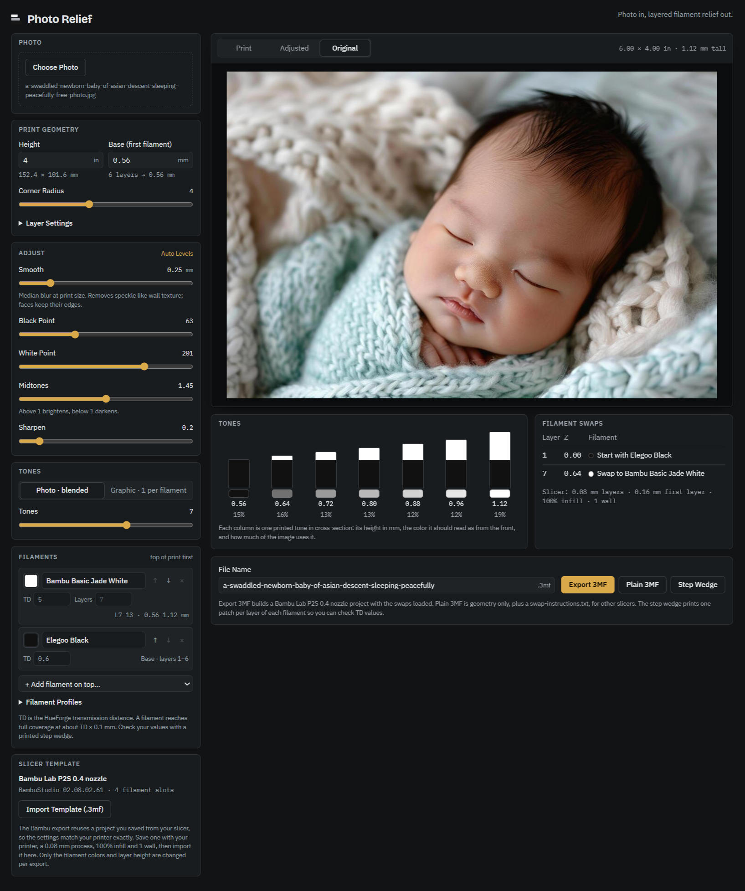
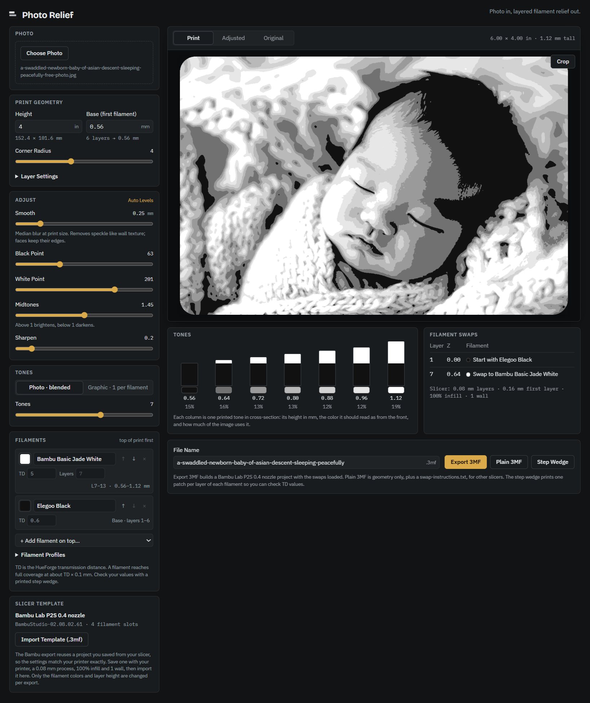

# Photo Relief

**A browser-only tool that turns a photo into a 3D-printable, multi-color relief.**

Upload a photo and Photo Relief converts it into a layered, multi-filament height
map — the [HueForge](https://shop.thehueforge.com/) style of print where stacked
bands of colored filament reproduce the image — then exports a print-ready 3MF you
can open directly in a slicer. There's no backend: all of the image processing, the
perceptual color modeling, and the watertight mesh generation run client-side in the
browser, off the main thread in a Web Worker. Your photos never leave your device.

## Demo

<!-- DEMO URL: paste the deployed link below -->

🔗 **[Live demo](https://3d-photo.jesseiancary.com/)**

<em>Original photo</em>

<em>Print preview — the layered multi-filament relief</em>

## Highlights

- **Perceptually-even color banding.** Rather than slicing the image into equal
  height steps, the engine simulates the printed color at every layer height and
  chooses filament swaps so the resulting tones are evenly spaced in **CIE L\***
  (perceptual lightness) — the bands look even to the eye, not just on paper.
- **Guaranteed watertight meshes.** Geometry is built as a single manifold solid:
  no T-junctions, every edge shared by exactly two triangles, diagonal-only
  pinch-points removed before walls go up. Slicers never choke on it.
- **Real-world 3MF export.** Produces Bambu Studio project files that survive the
  slicer's strict, undocumented config-loading rules (so colors and layer settings
  actually import), plus a plain-geometry mode for other slicers.
- **Runs fully offline.** A Web Worker keeps the UI responsive during heavy
  processing, with an automatic main-thread fallback for sandboxes that block
  workers.
- **Reproducible headless pipeline.** A Node CLI runs the exact same engine without
  a browser, so any result can be regenerated and tested from the command line.

## Tech stack

| Area        | Choices                                                        |
| ----------- | -------------------------------------------------------------- |
| Language    | TypeScript                                                     |
| UI          | React 19                                                       |
| Build       | Vite 8                                                         |
| Styling     | Tailwind CSS v4 (CSS-first — no `tailwind.config.js`)          |
| Concurrency | Web Workers (with a main-thread fallback)                      |
| Testing     | Vitest (Node unit + jsdom component/hook) and Playwright (e2e) |
| Tooling     | oxlint, Prettier, GitHub Actions CI                            |

The dependency footprint is deliberately small — the only runtime dependencies are
`clsx`, `tailwind-merge`, and `fflate` (ZIP for the 3MF container). The image
pipeline, color science, and mesh generation are all hand-written over typed arrays.

## Engineering tradeoffs

A few decisions worth calling out, and what they cost:

- **A pure, framework-free core.** The entire engine (`src/core/`) is pure functions
  over typed arrays — no DOM, no React, no worker APIs. That's more boilerplate (data
  is threaded in explicitly, with injection seams for I/O) but it means one
  implementation runs unchanged in four places: the browser, the Web Worker, the Node
  CLI, and the unit tests. Every stage is testable in isolation.
- **Browser-only, for now.** Shipping without a backend means zero hosting cost and
  real privacy — photos are processed entirely on-device — at the cost of no accounts
  or server-side saved projects yet. The architecture is kept SSR-friendly so it can
  grow into a Next.js + accounts app without a rewrite.
- **Reusing a real slicer project instead of synthesizing one.** Bambu Studio
  silently discards configuration it didn't write, so the exporter splices the mesh
  into a genuine saved project file rather than generating config from scratch. Less
  elegant, but it's the only approach that imports with colors intact — the kind of
  constraint you only find by reading the slicer's source.
- **Report-only test coverage.** CI publishes a coverage report as a build artifact
  but doesn't fail the build on a threshold — a pragmatic call that keeps the gate
  honest while the suite is still growing.

## Roadmap

Where this is headed:

- **Backend + user accounts** — server-side storage for images, the filament-profile
  library, and slicer templates (today these are localStorage / JSON).
- **Next.js** — SSR/RSC plus authentication, building on the kept-pure core.
- **shadcn/ui** — for the account and library CRUD screens, layered on the existing
  Tailwind token system.
- **Saved projects** — building on the recently-added interactive photo crop.
- **PrusaSlicer color-change export** — today PrusaSlicer users take the plain 3MF
  plus a swap-instructions file.
- **HEIC support** — currently HEIC photos must be converted to JPEG first.
- **A coverage gate** — once the suite stabilizes.

---

Want to run it locally, read the architecture, or contribute? See
**[docs/DEVELOPMENT.md](docs/DEVELOPMENT.md)**. The gory details of why 3MF export
works the way it does are in **[docs/bambu-3mf-export.md](docs/bambu-3mf-export.md)**.
